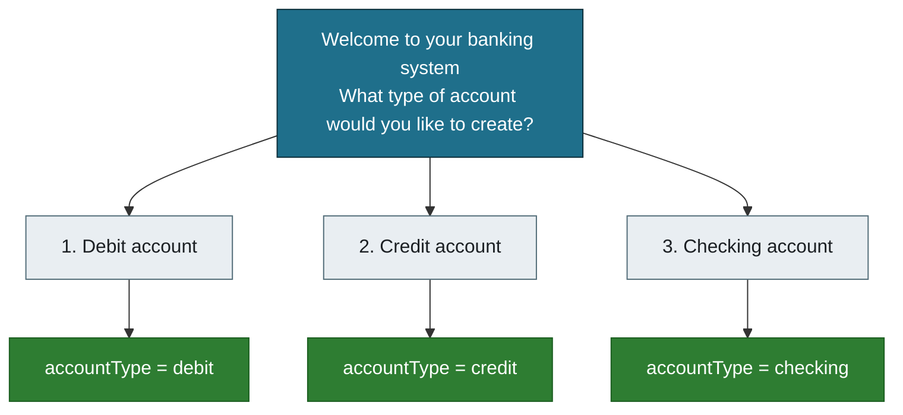
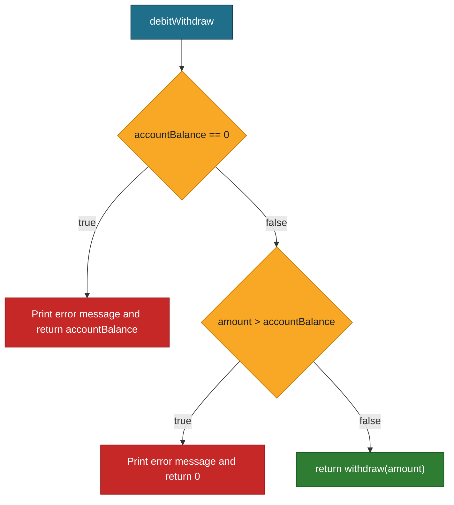
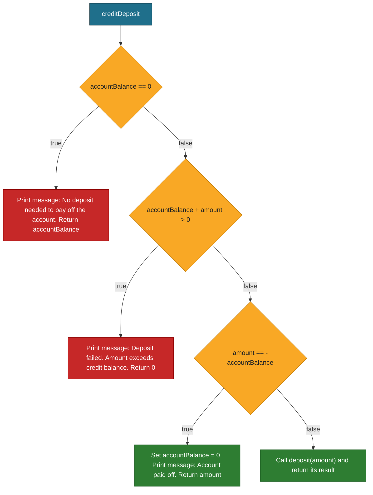

                ██████╗  █████╗ ███╗   ██╗██╗  ██╗
                ██╔══██╗██╔══██╗████╗  ██║██║ ██╔╝
                ██████╔╝███████║██╔██╗ ██║█████╔╝ 
                ██╔══██╗██╔══██║██║╚██╗██║██╔═██╗ 
                ██████╔╝██║  ██║██║ ╚████║██║  ██╗
                ╚═════╝ ╚═╝  ╚═╝╚═╝  ╚═══╝╚═╝  ╚═╝
                                                  
                 █████╗  ██████╗ ██████╗ ██████╗ ██╗   ██╗███╗   ██╗████████╗
                ██╔══██╗██╔════╝██╔════╝██╔═══██╗██║   ██║████╗  ██║╚══██╔══╝
                ███████║██║     ██║     ██║   ██║██║   ██║██╔██╗ ██║   ██║   
                ██╔══██║██║     ██║     ██║   ██║██║   ██║██║╚██╗██║   ██║   
                ██║  ██║╚██████╗╚██████╗╚██████╔╝╚██████╔╝██║ ╚████║   ██║   
                ╚═╝  ╚═╝ ╚═════╝ ╚═════╝ ╚═════╝  ╚═════╝ ╚═╝  ╚═══╝   ╚═╝ 
# Description
This is a Kotlin console application to management a bank account 🏦 and make banking operations 💸🏧

# Made with
[]()

# Project Flow



# Debit Withdraw Logic



# Credit Deposit Logic



## 📊 Code Coverage

Execute **JaCoCo** to measure the code coverage.

### Instalación del Pre-commit Hook

Execute once to install the hook:

```bash
$ bash scripts/install-hooks.sh

```